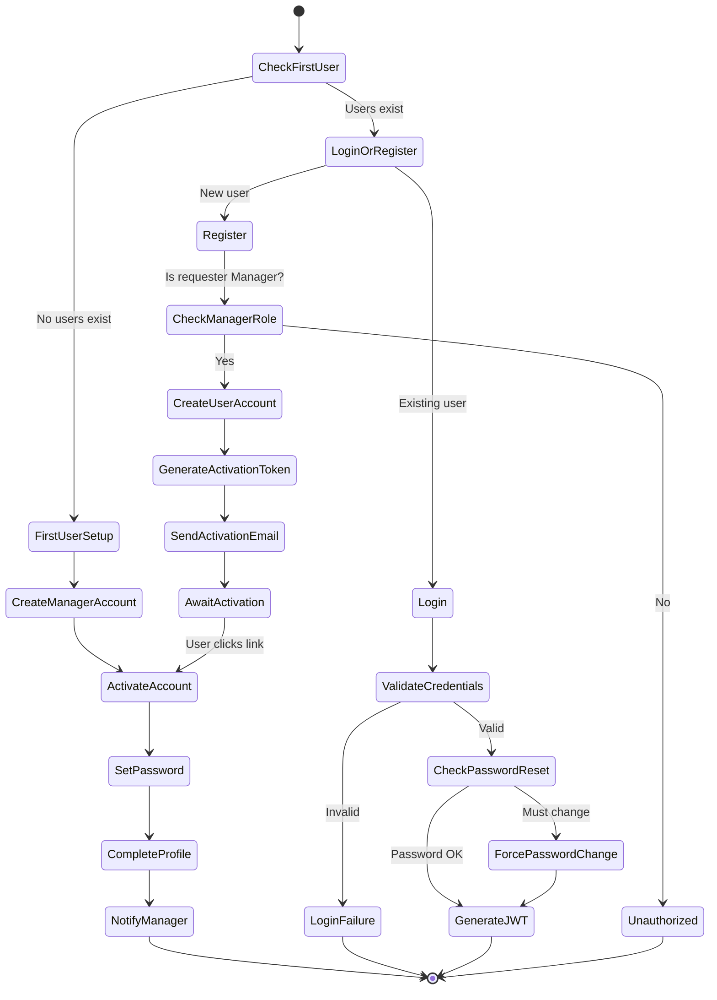
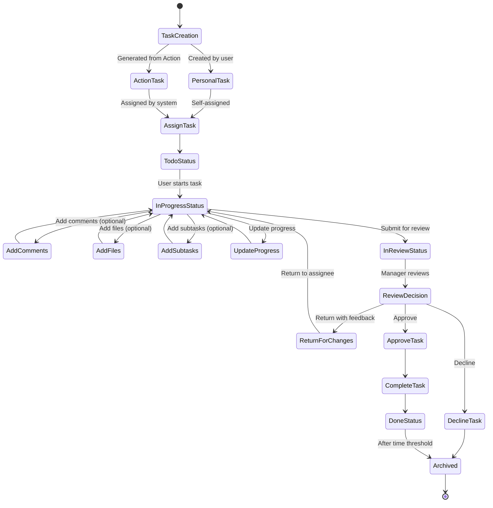
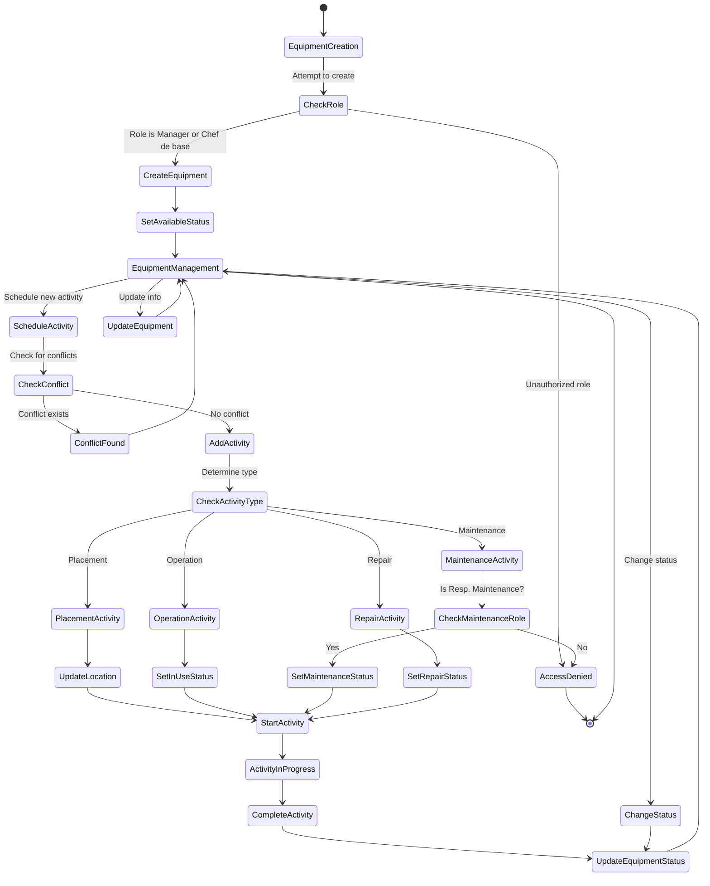
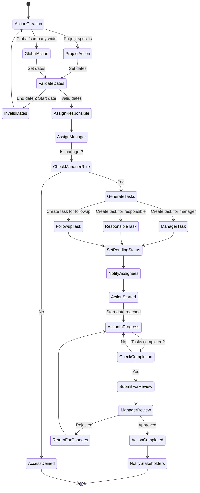
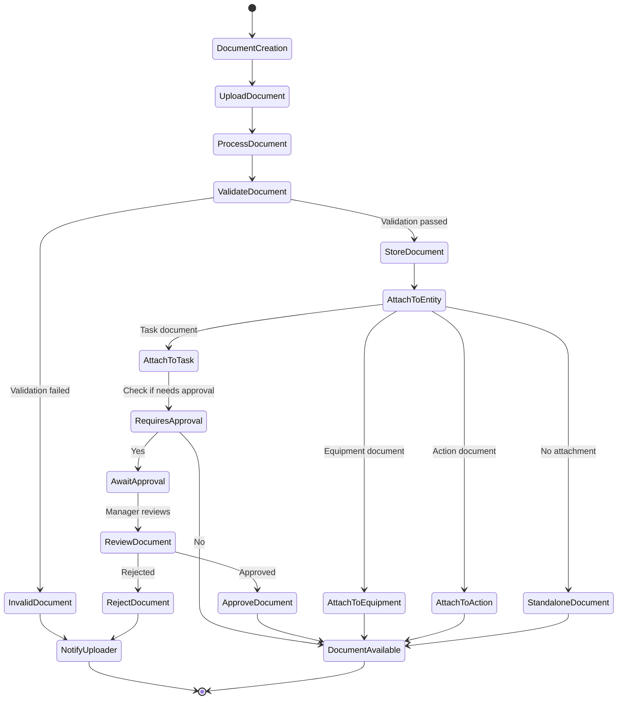
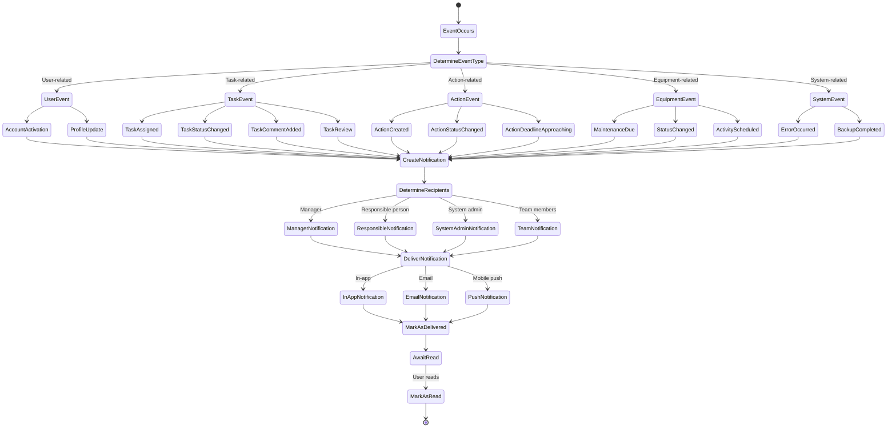

# PetroConnect Activity Diagrams

This document describes the key workflows and processes in the PetroConnect system using activity diagrams.

## 1. User Authentication and Registration Flow

## 2. Task Management Workflow

## 3. Equipment Management Workflow

## 4. Action Management Workflow

## 5. Document Workflow

## 6. Notification System Flow

## Key Workflows Explanation

### 1. User Authentication and Registration

- New users are created only by Managers (except first system user)
- Account activation requires email verification
- First-time login requires password change
- JWT tokens are used for authentication

### 2. Task Management

- Tasks can be personal or generated from Actions
- Status workflow: Todo → In Progress → In Review → Done
- Tasks can have comments, files, and subtasks
- Tasks requiring validation need manager approval
- Completed tasks are archived after a time threshold

### 3. Equipment Management

- Equipment creation restricted to Manager and Chef de base roles
- Equipment has various statuses (Available, In Use, Maintenance, etc.)
- Activities are scheduled with conflict detection
- Maintenance activities can only be managed by Resp. Maintenance

### 4. Action Management

- Actions can be project-specific or global
- Actions generate tasks for different responsible parties
- Action workflow includes validation by manager
- Actions can have hierarchical relationships

### 5. Document Management

- Documents can be attached to various entities
- Some documents require approval
- Storage uses Cloudinary for cloud-based storage
- Documents have metadata and access control

### 6. Notification System

- Notifications triggered by various system events
- Multiple delivery channels (in-app, email, push)
- Different recipients based on event type and role
- Read status tracking 