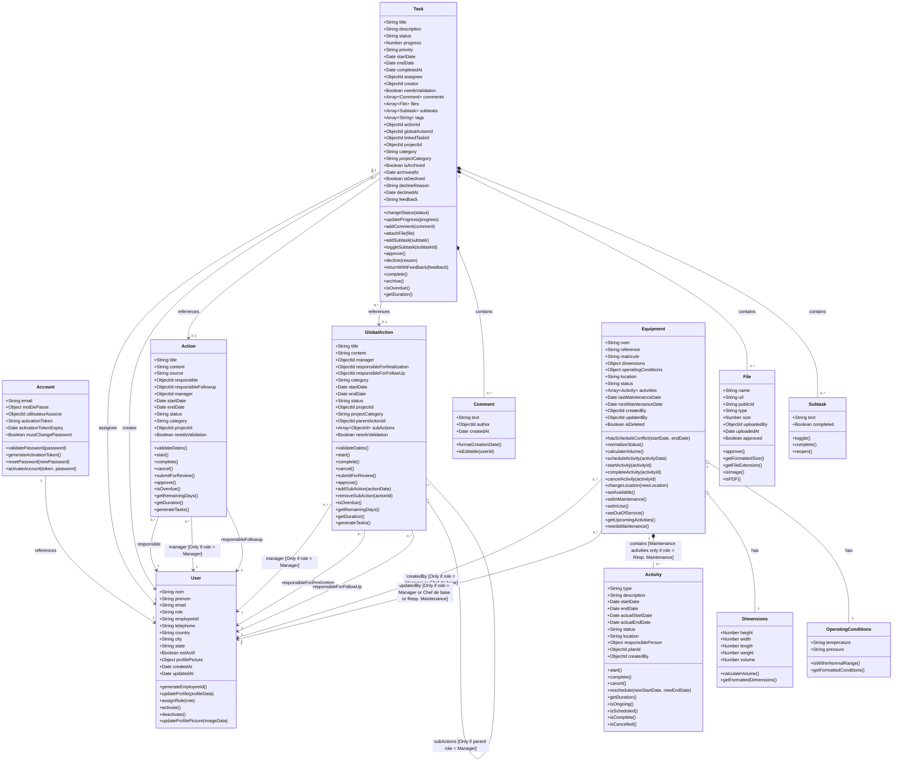

# PetroConnect Core Entity Class Diagram

## Role-Based Access Constraints

The system enforces various role-based constraints on entity relationships:

1. **Equipment Management**:
   - Only users with role "Manager" or "Chef de base" can create equipment
   - Only users with role "Manager", "Chef de base", or "Resp. Maintenance" can update equipment
   - Maintenance activities for equipment can only be managed by users with "Resp. Maintenance" role

2. **Action Management**:
   - Only users with role "Manager" can be assigned as the manager of an Action or GlobalAction
   - Only users with role "Manager" can create sub-actions under a GlobalAction

3. **Task Access Control**:
   - All users can be assigned to tasks
   - All users can create personal tasks
   - Task validation workflow enforces role-based approval processes

4. **User Management**:
   - Only users with role "Manager" can create other users (except for the first user)
   - Only users with role "Manager" can assign roles to users

## Relationship Cardinality Explanation

- **One-to-One (1-1)**: 
  - Each Account references exactly one User
  - Each Equipment has exactly one Dimensions object
  - Each Equipment has exactly one OperatingConditions object

- **One-to-Many (1-*)**: 
  - Each User can be the assignee for many Tasks (0 or more)
  - Each User can be the creator for many Tasks (0 or more)
  - Each User can be responsible for many Actions (0 or more)
  - Each User can be manager for many Actions (0 or more)
  - Each Task contains many Comments (0 or more)
  - Each Task contains many Files (0 or more)
  - Each Task contains many Subtasks (0 or more)
  - Each Equipment contains many Activities (0 or more)
  - Each GlobalAction can have many child GlobalActions (0 or more)

- **Many-to-One (*-1)**:
  - Many Tasks can reference the same User as assignee
  - Many Tasks can reference the same User as creator
  - Many Tasks can reference the same Action (optional)
  - Many Tasks can reference the same GlobalAction (optional)
  - Many Actions can reference the same User as responsible
  - Many Equipment can reference the same User as creator

- **Optional Relationships (0..1)**:
  - Tasks may or may not be associated with an Action (optional)
  - Tasks may or may not be associated with a GlobalAction (optional)
  - GlobalActions may or may not have a parent GlobalAction (optional)

## Functional Areas & Business Logic

### User Management
- User account creation and activation
- Role-based authorization
- Profile management
- Password management (reset, change)

### Task Management
- Task creation (personal, project-related, action-related)
- Task assignment
- Status tracking (todo, inProgress, inReview, done)
- Task validation/review process
- File attachments with approval workflow
- Comments and subtasks
- Task archiving

### Action Management
- Project action tracking
- Global action tracking
- Hierarchical actions (parent-child relationships)
- Action status management
- Task generation from actions

### Equipment Management
- Equipment inventory tracking
- Activity scheduling (placement, operation, maintenance, repair)
- Status management (available, in use, maintenance, repair, out of service)
- Conflict detection for scheduling
- Dimension and operating condition tracking 