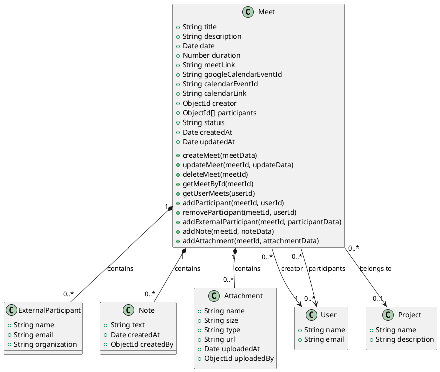
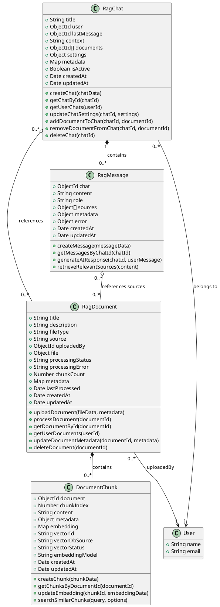
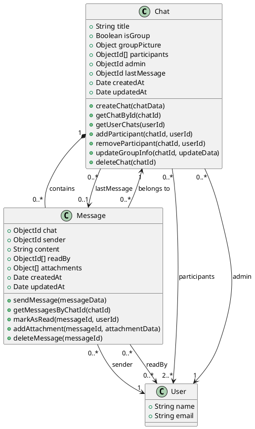
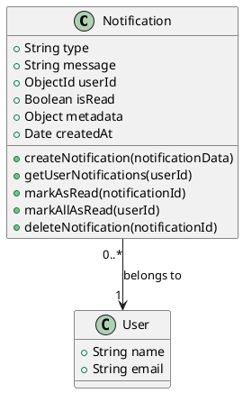
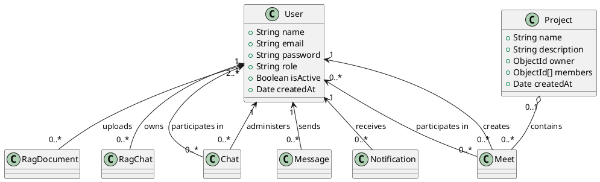

# Petroleum Backend Modules Class Diagram (PlantUML)

This document provides PlantUML class diagrams for the following modules:
- Meet Module
- RAG Module
- Chat Module
- Notifications Module

## Meet Module

## RAG Module (Retrieval-Augmented Generation)

## Chat Module

## Notifications Module

## Cross-Module Relationships

Note: 
- Composition relationships (*--) indicate strong ownership where the child cannot exist without the parent
- Aggregation relationships (o--) indicate a weaker "has-a" relationship where the child can exist independently
- Association relationships (-->) indicate that classes are related but neither owns the other
- Cardinality notation:
  - "0..1": Zero or one
  - "1": Exactly one
  - "0..*": Zero or many
  - "1..*": One or many
  - "2..*": Two or many (e.g., for chat participants) 