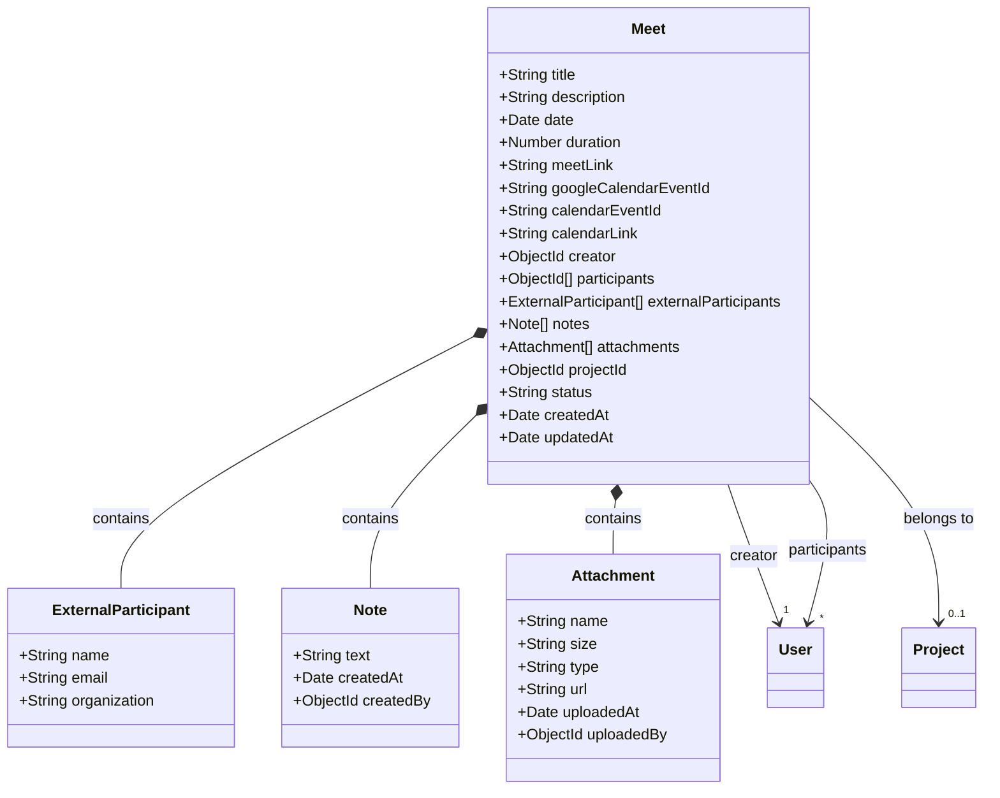
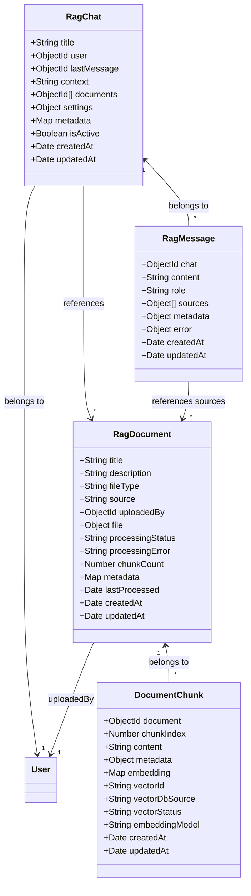
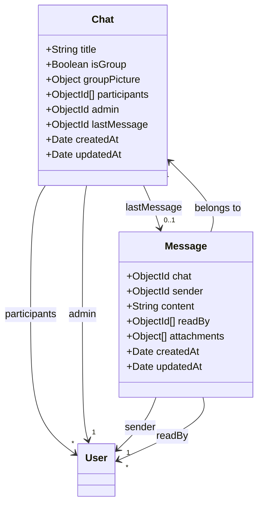
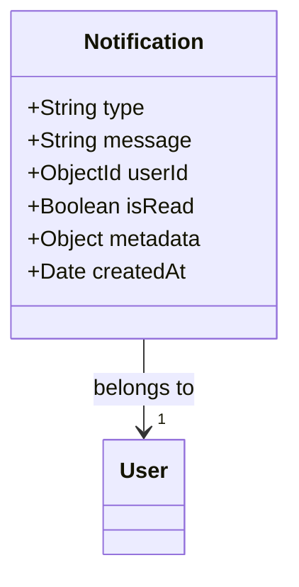
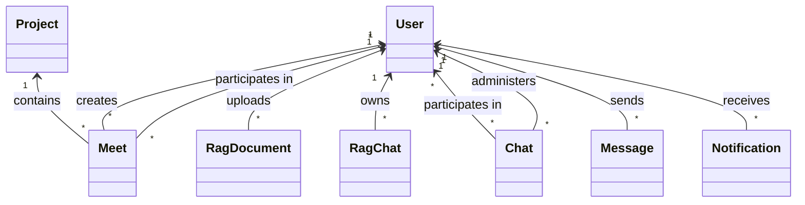

# Petroleum Backend Modules Class Diagram

This document provides class diagrams for the following modules:
- Meet Module
- RAG Module
- Chat Module
- Notifications Module

## Meet Module

## RAG Module (Retrieval-Augmented Generation)

## Chat Module

## Notifications Module

## Cross-Module Relationships

Note: This diagram shows the main entities and their relationships. The actual implementation may include additional methods, validators, and middleware that are not represented here. 