# Petroleum Frontend - Client-Side Architecture Documentation

This document outlines the client-side architecture of the Petroleum Management System frontend, following the MVVM (Model-View-ViewModel) pattern with React and Redux.

## MVVM Architecture Overview

The application follows a modified MVVM pattern adapted for React and Redux:

1. **Model Layer**: Represents the data and business logic
   - Redux store (data)
   - Types/Interfaces (data structure)
   - Services (API communication)

2. **ViewModel Layer**: Connects the Model to the View
   - Redux slices (state management)
   - Custom hooks (reusable logic)
   - Context providers (shared state)

3. **View Layer**: UI components that render the application
   - React components (presentation)
   - Layout components (structure)
   - UI library components (design system)

## Class Diagram

```mermaid
classDiagram
    %% Core MVVM Structure
    class Model {
        +interfaces/types
        +data structures
    }
    
    class ViewModel {
        +state management
        +business logic
        +data transformation
    }
    
    class View {
        +render UI components
        +handle user interactions
        +display data
    }
    
    Model -- ViewModel : Provides data
    ViewModel -- View : Provides state & handlers

    %% Model Layer
    class ApiService {
        +makeRequest()
        +handleErrors()
    }
    
    class Store {
        +configureStore()
        +state
        +dispatch()
        +getState()
    }
    
    %% Core Data Models - based on backend entities
    class UserModel {
        +_id: string
        +nom: string
        +prenom: string
        +email: string
        +role: string
        +employeeId: string
        +telephone: string
        +country: string
        +estActif: boolean
        +profilePicture: object
    }
    
    class ProjectModel {
        +_id: string
        +name: string
        +projectNumber: string
        +clientName: string
        +description: string
        +startDate: string
        +endDate: string
        +status: string
        +categories: string[]
        +equipment: object[]
        +createdBy: string
    }
    
    class TaskModel {
        +_id: string
        +title: string
        +description: string
        +status: string
        +progress: number
        +priority: string
        +startDate: string
        +endDate: string
        +assignee: string
        +creator: string
        +comments: object[]
        +files: object[]
        +subtasks: object[]
    }
    
    class EquipmentModel {
        +_id: string
        +nom: string
        +reference: string
        +matricule: string
        +dimensions: object
        +operatingConditions: object
        +location: string
        +status: string
    }
    
    class ActionModel {
        +_id: string
        +title: string
        +content: string
        +status: string
        +startDate: string
        +endDate: string
        +responsible: string
        +responsibleFollowup: string
        +manager: string
        +category: string
        +projectId: string
    }
    
    class DocumentModel {
        +_id: string
        +name: string
        +url: string
        +publicId: string
        +category: string
        +projectId: string
        +uploadedBy: string
    }
    
    class MeetModel {
        +_id: string
        +title: string
        +description: string
        +date: string
        +participants: string[]
        +externalParticipants: object[]
        +notes: object[]
        +attachments: object[]
    }
    
    class ChatModel {
        +_id: string
        +title: string
        +isGroup: boolean
        +participants: string[]
        +admin: string
        +lastMessage: string
    }
    
    class MessageModel {
        +_id: string
        +chat: string
        +sender: string
        +content: string
        +readBy: string[]
        +attachments: object[]
    }
    
    class EmployeeModel {
        +_id: string
        +name: string
        +email: string
        +phone: string
        +position: string
        +department: string
        +folders: object[]
    }
    
    %% ViewModel Layer - Redux Slices
    class AuthSlice {
        +state
        +login()
        +logout()
        +checkAuth()
    }
    
    class UserSlice {
        +state
        +fetchUsers()
        +createUser()
        +updateUser()
        +deleteUser()
    }
    
    class ProjectSlice {
        +state
        +fetchProjects()
        +fetchProjectById()
        +createProject()
        +updateProject()
        +deleteProject()
    }
    
    class TaskSlice {
        +state
        +fetchTasks()
        +fetchTaskById()
        +createTask()
        +updateTask()
        +deleteTask()
    }
    
    class EquipmentSlice {
        +state
        +fetchEquipment()
        +fetchEquipmentById()
        +createEquipment()
        +updateEquipment()
        +deleteEquipment()
        +fetchEquipmentHistory()
    }
    
    class ActionSlice {
        +state
        +fetchActions()
        +fetchActionById()
        +createAction()
        +updateAction()
    }
    
    class GlobalActionSlice {
        +state
        +fetchGlobalActions()
        +fetchGlobalActionById()
        +createGlobalAction()
        +updateGlobalAction()
    }
    
    class DocumentSlice {
        +state
        +fetchDocuments()
        +uploadDocument()
        +deleteDocument()
    }
    
    class ChatSlice {
        +state
        +fetchChats()
        +fetchMessages()
        +sendMessage()
        +createChat()
    }
    
    class MeetingSlice {
        +state
        +fetchMeetings()
        +createMeeting()
        +updateMeeting()
        +cancelMeeting()
    }
    
    class NotificationSlice {
        +state
        +fetchNotifications()
        +markAsRead()
    }
    
    class EmployeesSlice {
        +state
        +fetchEmployees()
        +createEmployee()
        +updateEmployee()
        +deleteEmployee()
    }
    
    %% Custom Hooks
    class useModal {
        +isOpen: boolean
        +openModal()
        +closeModal()
    }
    
    class useGoBack {
        +goBack()
    }
    
    class useAppSelector {
        +select state from store
    }
    
    class useAppDispatch {
        +dispatch actions
    }
    
    %% View Layer - Main Page Components
    class HomePage {
        +render()
    }
    
    class ProjectsPage {
        +render()
    }
    
    class TasksPage {
        +render()
    }
    
    class EquipmentPage {
        +render()
    }
    
    class ActionsPage {
        +render()
    }
    
    class DocumentsPage {
        +render()
    }
    
    class ChatPage {
        +render()
    }
    
    class MeetingsPage {
        +render()
    }
    
    class GestionRHPage {
        +render()
    }
    
    %% UI Components
    class AppLayout {
        +render()
    }
    
    class AppSidebar {
        +render()
    }
    
    class AppHeader {
        +render()
    }
    
    class Notifications {
        +render()
    }
    
    class DocumentViewer {
        +render()
    }
    
    class TaskDetailPanel {
        +render()
    }
    
    class GlobalActionView {
        +render()
    }
    
    class EquipmentDetailView {
        +render()
    }
    
    class PlanningCalendar {
        +render()
    }
    
    %% Relationships
    Model -- ApiService
    Model -- Store
    
    Model --|> UserModel
    Model --|> ProjectModel
    Model --|> TaskModel
    Model --|> EquipmentModel
    Model --|> ActionModel
    Model --|> DocumentModel
    Model --|> MeetModel
    Model --|> ChatModel
    Model --|> MessageModel
    Model --|> EmployeeModel
    
    ViewModel -- Store
    ViewModel --|> AuthSlice
    ViewModel --|> UserSlice
    ViewModel --|> ProjectSlice
    ViewModel --|> TaskSlice
    ViewModel --|> EquipmentSlice
    ViewModel --|> ActionSlice
    ViewModel --|> GlobalActionSlice
    ViewModel --|> DocumentSlice
    ViewModel --|> ChatSlice
    ViewModel --|> MeetingSlice
    ViewModel --|> NotificationSlice
    ViewModel --|> EmployeesSlice
    
    ViewModel --|> useModal
    ViewModel --|> useGoBack
    ViewModel --|> useAppSelector
    ViewModel --|> useAppDispatch
    
    View --|> AppLayout
    View --|> AppSidebar
    View --|> AppHeader
    View --|> HomePage
    View --|> ProjectsPage
    View --|> TasksPage
    View --|> EquipmentPage
    View --|> ActionsPage
    View --|> DocumentsPage
    View --|> ChatPage
    View --|> MeetingsPage
    View --|> GestionRHPage
    
    View --|> Notifications
    View --|> DocumentViewer
    View --|> TaskDetailPanel
    View --|> GlobalActionView
    View --|> EquipmentDetailView
    View --|> PlanningCalendar
```

## Detailed Component Descriptions

### Model Layer

The Model layer includes all the data structures and interfaces that represent the application's core data. These are defined in TypeScript interfaces in the `/src/types` directory:

1. **UserModel**: Represents user information including authentication details
2. **ProjectModel**: Represents project data including all related metadata
3. **TaskModel**: Contains task data structure with status, assignments, etc.
4. **EquipmentModel**: Equipment inventory data with specifications
5. **ActionModel**: Project-specific actions with responsibilities
6. **DocumentModel**: Document metadata and storage information
7. **MeetModel**: Meetings data with participants and schedules
8. **ChatModel**: Chat room information
9. **MessageModel**: Individual chat messages
10. **EmployeeModel**: HR employee records

### ViewModel Layer

The ViewModel layer connects the data models to the UI components through Redux slices and custom hooks:

#### Redux Slices (/src/store/slices)

1. **AuthSlice**: Manages authentication state and user sessions
2. **UserSlice**: Handles user data operations
3. **ProjectSlice**: Manages project CRUD operations
4. **TaskSlice**: Handles task operations and filtering
5. **EquipmentSlice**: Manages equipment inventory
6. **ActionSlice**: Controls project action operations
7. **GlobalActionSlice**: Manages global action operations
8. **DocumentSlice**: Handles document operations
9. **ChatSlice**: Manages chat and message operations
10. **MeetingSlice**: Controls meeting scheduling and management
11. **NotificationSlice**: Handles system notifications
12. **EmployeesSlice**: Manages HR employee records

#### Custom Hooks (/src/hooks)

1. **useModal**: Manages modal dialog state
2. **useGoBack**: Navigation hook for back functionality
3. **useAppSelector**: Typed Redux selector hook
4. **useAppDispatch**: Typed Redux dispatch hook

### View Layer

The View layer consists of React components that render the UI and handle user interactions:

#### Page Components

1. **HomePage**: Dashboard with overview of key metrics
2. **ProjectsPage**: Project management interface
3. **TasksPage**: Task management and tracking
4. **EquipmentPage**: Equipment inventory management
5. **ActionsPage**: Action management interface
6. **DocumentsPage**: Document repository and management
7. **ChatPage**: Messaging interface
8. **MeetingsPage**: Meeting scheduling and management
9. **GestionRHPage**: HR employee management

#### UI Components

1. **AppLayout**: Main application layout structure
2. **AppSidebar**: Navigation sidebar component
3. **AppHeader**: Application header with user controls
4. **Notifications**: Notification display system
5. **DocumentViewer**: Document preview component
6. **TaskDetailPanel**: Task detail display panel
7. **GlobalActionView**: Action details component
8. **EquipmentDetailView**: Equipment details view
9. **PlanningCalendar**: Calendar view for scheduling

## Data Flow in MVVM Architecture

1. **User Interaction**: The user interacts with a View component (e.g., submitting a form)

2. **View to ViewModel**: The View calls a method from the ViewModel (e.g., dispatching a Redux action)

3. **ViewModel to Model**: The ViewModel processes the request and communicates with the Model (e.g., making an API call via a service)

4. **Model to ViewModel**: The Model returns data to the ViewModel (e.g., API response)

5. **ViewModel to View**: The ViewModel updates its state, which the View observes and rerenders accordingly

## Key Design Patterns

1. **Observer Pattern**: Implemented through Redux where components subscribe to state changes

2. **Command Pattern**: Used in Redux actions to encapsulate operations

3. **Dependency Injection**: Provided through React's Context API and component props

4. **Facade Pattern**: API services abstract the complexity of backend communication

5. **Composite Pattern**: Component composition for building complex UI structures

## Technology Stack

- **React**: UI library
- **Redux Toolkit**: State management
- **TypeScript**: Type safety
- **React Router**: Navigation
- **Axios**: API communication
- **Tailwind CSS**: Styling
